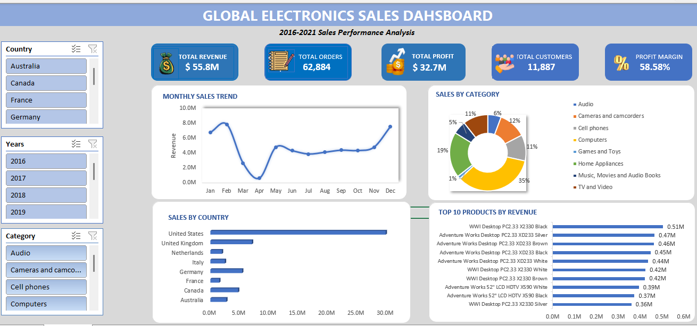

📊 Global Electronics Sales Dashboard
##Project Overview
Developed an interactive sales dashboard in Microsoft Excel to analyze sales performance, profitability, customer behavior, and product trends using global electronics sales data (2016–2021).
##Tools Used
Microsoft Excel
Pivot Tables
Pivot Charts
Slicers
Conditional Formatting
##KPIs
Revenue: $55.8M
Profit: $32.7M
Orders: 62,884
Customers: 11,887
Profit Margin: 58.58%
##Key Insights
United States generated the highest revenue among all countries.
Computers was the top-performing product category.
Sales peaked during January, February, and December.
Desktop PCs and LCD TVs were the highest revenue-generating products.
Strong repeat purchase behavior was observed from customers.
Business Recommendations
Increase focus on high-performing markets like the United States.
Prioritize inventory and marketing for the Computers category.
Run promotional campaigns during low-sales periods.
Maintain stock availability for top-selling products.
Dashboard Preview

##Skills Demonstrated
Data Cleaning
Data Analysis
Data Visualization
Dashboard Development
Business Intelligence
KPI Reporting
